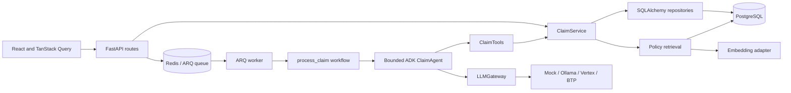

# Teaching the claims application: code, logic, agents, memory and RAG

This is a source-based guide to the four completed teaching branches. The current checkout is **Week 1**. Behavior from another week is explicitly labelled; branch-specific code links point to GitHub rather than implying that every implementation exists here.

Read [the week-by-week comparison](WEEK_BY_WEEK.md) alongside this guide. For operating instructions use [Week1.md](Week1.md), [Week2.md](Week2.md), and the corresponding branch's Week3/Week4 document. The older PRD and architecture documents describe earlier scope; the actual branch and its implementation guide define the demo behavior.

## 1. What the application demonstrates

An expense claim contains recorded business facts. Software calculates policy checks. AI interprets supplied context in structured form. An application service controls whether a review or a final decision is recorded. The permitted role of AI changes by week:

| Week | AI role | Decision owner |
| --- | --- | --- |
| 1 | Summarize facts and answer clarifying questions | Manager: Accept / Reject / Investigate |
| 2 | Recommend Accept / Reject | Manager: Accept / Reject for every expense |
| 3 | Recommend Accept / Reject / Investigate | Application executes eligible clear cases; manager handles escalations |
| 4 | Investigate supplied records, then assess | Autonomous application records Accept / Reject |

All four branches contain shared scaffolding because Weeks 1 and 2 were created by stripping back Week 3. Do not teach that every library or subsystem was first introduced in the week whose number matches the feature. Teach the change in **decision authority** and point to the implemented code.

The demo records claims decisions in a database. It does not send reimbursement payments, ingest new employee claims through a submission UI, upload receipts, perform OCR, contact merchants, or verify receipts against external systems. The seven sample claims and text receipts come from `seed.py`.

## 2. Architecture and ownership



| Layer | Main file | Responsibility |
| --- | --- | --- |
| App entry | [`main.py`](../backend/app/main.py) | FastAPI, CORS, exception handling, HTTP correlation and instrumentation |
| Routes | [`api/routes.py`](../backend/app/api/routes.py) | Validate requests/roles, invoke services/workflow/jobs |
| Service | [`assessment/service.py`](../backend/app/assessment/service.py) | Business state, source/version controls, reviews, outcomes, audit |
| Repository | [`db/repositories/claims.py`](../backend/app/db/repositories/claims.py) | SQL queries and session operations |
| Rule engine | [`domain/policy.py`](../backend/app/domain/policy.py) | Decimal/date/evidence checks without model arithmetic |
| Workflow | [`workflows/process_claim.py`](../backend/app/workflows/process_claim.py) | Build a run, provider, tools, agent and ADK session; handle failure |
| Agent | [`agents/claim_agent.py`](../backend/app/agents/claim_agent.py) | Fixed retrieval/model/persistence trajectory |
| Agent tools | [`tools/claims.py`](../backend/app/tools/claims.py) | Restricted service interface, trajectory and telemetry |
| Model gateway | [`ai/gateway.py`](../backend/app/ai/gateway.py) | Construct context/schema/prompt, await model, validate output |
| Provider adapters | [`ai/providers/`](../backend/app/ai/providers/) | Provider-specific authentication and inference wire formats |
| Jobs | [`jobs/worker.py`](../backend/app/jobs/worker.py) | Enqueueing, execution, retries, heartbeat and job status |
| Policy RAG | [`rag/`](../backend/app/rag/) | Index Markdown, embed query, retrieve policy passages |
| Chat | [`assistant/service.py`](../backend/app/assistant/service.py) | Grounded read-only answers with validated citations |
| Frontend | [`App.tsx`](../frontend/src/App.tsx) | Workspace, hash navigation and page selection |

The service owns the database mutations. The model returns data. This separation is why removing recommendations in Week 1 does not require replacing the database, React app or ARQ queue.

### Reading order for a teacher

Read `seed.py` and `db/models/__init__.py` to learn the data. Then read `domain/policy.py`, `api/routes.py`, `workflows/process_claim.py`, `agents/claim_agent.py`, `tools/claims.py`, `ai/gateway.py`, and `assessment/service.py`. Finally read the repository, RAG files, assistant service and frontend screens. Read the tests beside each subsystem to see the behavior being asserted.

Several directory names are scaffolding, not active subsystems. `orchestration/claim_workflow.py` re-exports the real workflow. `memory/service.py` is a thin wrapper; active retrieval goes through ClaimService and its repository. `agents/investigation_agent.py` contains a historical explanatory docstring, not an instantiated second agent. On Week 4, the actual investigation is another model call inside ClaimAgent. Empty `governance/` or `prompts/` modules do not implement a separate policy engine or prompt registry.

## 3. The data model, table by table

Source: [`db/models/__init__.py`](../backend/app/db/models/__init__.py) and Alembic migrations.

| Table | What it stores | Why it exists |
| --- | --- | --- |
| `employees` | Name, email, department | Claim ownership/context |
| `policies` | Text, currency, auto-action flags | Applicable policy and action permissions |
| `policy_rules` | Code plus JSON parameters | Machine-readable deterministic rule settings |
| `claims` | Employee/policy references, title, amount, date, status, version | Current business record |
| `claim_lines` | Category, description, amount, expense date | Item-level expense facts |
| `evidence` | Kind, filename, text content, fingerprint, line reference, verified flag | Supporting records and duplicate detection |
| `policy_findings` | Check code, severity, message, evidence IDs, claim version | Persisted results of deterministic checks |
| `claim_assessments` | Run ID, source claim version, structured JSON | Week-specific fact summary or AI assessment |
| `review_tasks` | Assessment reference, reason, evidence, missing questions, role, active/status | Manager work item |
| `review_decisions` | Actor, action, rationale, timestamp | Manager action history; also AI closure of old reviews in Week 4 |
| `outcome_records` | Context snapshot, findings, final decision, rationale, reviewed flag | Durable business memory after a final decision |
| `audit_events` | Claim, event, actor, run, timestamp, event data | Business trace of what happened |
| `ai_executions` | Provider/model, success/failure, duration, usage, trajectory, error type | Model/workflow diagnostic history |
| `policy_chunks` | Policy/source/heading/text/hash/model identity plus vector | Retrieval index for policy RAG |

A claim can have many lines, evidence items, findings, executions and audit events. A review can have several manager actions. One partial unique index permits only one **active** review for a claim. The outcome table has a unique claim reference so a finalized claim cannot accumulate multiple final outcomes through repeated submissions.

Amounts use `Numeric(12,2)` in storage and Python `Decimal` in checks. API encoding converts Decimal values to strings, so a JSON amount such as `"84.50"` preserves its financial representation.

The `Claim.version` field is SQLAlchemy's optimistic version column. Changing business state advances its version. Week 1 explicitly advances it for every manager action, including another Investigate action that leaves the same status, so an older screen cannot submit a stale decision.

### Assessment is a legacy table name

Week 1 uses the same `claim_assessments` table to store:

```json
{
  "confidence": 0.99,
  "findings": ["receipt_required"],
  "evidence_ids": [],
  "unresolved_questions": ["Supporting evidence is missing or unverified."],
  "summary": "CLM-003 ... Verified receipt missing for Airport taxi ..."
}
```

There is no `recommendation`. The old outcome table still requires a recommendation column; Week 1 writes the compatibility marker `not_applicable` and omits it from API responses. That marker is not an AI recommendation.

Week 2/3 JSON contains `recommendation` and `explanation`. Week 4 adds an `investigation` object and `decision_mode: autonomous` to its persisted assessment. A shared table name does not mean every branch has the same JSON contract.

## 4. A request traced from the browser to a saved summary

Consider Week 1's Run button.

1. `ClaimQueue.tsx` gets the claim list and the worker's availability. It selects submitted claims.
2. `api.batch(ids)` sends `POST /api/jobs/assess` with a JSON array of claim IDs.
3. The route checks that the batch has 1–100 items and the selected claims are submitted.
4. `enqueue_batch()` checks the Redis health key, deduplicates IDs, creates a UUID batch, and queues `assess_claim` jobs.
5. The API returns **202 Accepted** and job IDs. This means queued, not assessed or decided.
6. The worker consumes each job, creates a SQLAlchemy session/repository/service, reloads the claim and calls `process_claim()`.
7. The workflow verifies status/version, constructs the agent runtime, and starts ADK's Runner.
8. ClaimAgent retrieves the facts in a fixed order, optionally retrieves policy passages, and persists the input/check audit.
9. LLMGateway asks for a schema-constrained factual summary. The selected provider returns JSON.
10. The gateway validates structure and source references. ClaimService rechecks the current claim/version/source snapshot before saving.
11. Week 1 saves the summary and opens manager review. It does not create a final outcome.
12. The worker returns `{claim_id, status}`. The UI polls job status, invalidates cached claims/reviews and shows the updated records.

The synchronous `POST /api/claims/{id}/process` route calls the same workflow directly and needs no queue worker. It remains an API even though the UI uses batch controls instead of per-claim processing buttons.

### API map

| Endpoint | Purpose |
| --- | --- |
| `GET /api/health` | API status and provider; Week 4 adds decision mode |
| `GET /api/claims` | Claims with latest summary/assessment |
| `GET /api/claims/{id}` | Facts, policy, evidence, findings, assessment, active review, outcome and history |
| `POST /api/claims/{id}/process` | Version-aware synchronous workflow |
| `GET /api/claims/{id}/memory` | Related prior outcomes |
| `GET /api/reviews` | Manager work items |
| `GET /api/reviews/{id}` | Review plus detailed claim and manager history |
| `POST /api/reviews/{id}/decisions` | Manager action; disabled in Week 4 autonomous mode |
| `POST /api/jobs/assess` | Queue a batch and return 202 plus job IDs |
| `GET /api/jobs/active` | Queue jobs and heartbeat readiness |
| `GET /api/jobs/status?job_ids=...` | Worker job progress/results |
| `POST /api/chat` | Read-only clarifying answer |

Routes accept the demo role headers. Claim reads/processing require analyst or manager; decisions require manager plus a nonblank actor identity. The frontend sends `X-Role: manager` and `X-Actor: local-manager`. This is a trusted local demo convention, not a login system.

## 5. Deterministic policy logic

Source: [`domain/policy.py`](../backend/app/domain/policy.py).

The function receives claim, policy, evidence and duplicate IDs. It creates finding objects containing `code`, `severity`, `message`, and `evidence_ids`.

| Check | Exact condition |
| --- | --- |
| Positive amounts | Claim amount > 0; lines exist; every line amount > 0 |
| Total | Sum of line Decimal amounts equals the claim Decimal amount |
| Currency | Claim currency equals policy currency |
| Limit | Claim amount does not exceed configured `amount_limit.maximum` |
| Categories | Every line category is in `allowed_category.categories` |
| Dates | No future submission/expense; expense does not follow submission; age within configured days |
| Receipt coverage | Every line has a verified receipt of kind `receipt` tied to that line |
| Duplicate fingerprints | Another claim's evidence has a supplied evidence fingerprint |

The sample policy is USD, maximum $500, categories meals/travel/supplies, verified receipts per line, and a 90-day submission window. Those values come from seeded rule parameters, not from asking the model to infer arithmetic.

If no issues are found, the function returns one aggregate `compliant` finding with severity `pass`. It does not emit a separate pass record for every successful rule. If issues exist, it returns the issue findings instead.

Week 1 uses `issue` for rule violations and `unverified` for unsupported information. Week 2 uses `reject`/`unverified` internally to inform advice. Week 3/4 use `reject`/`investigate`/`pass` internally. A finding severity is not the claim's final status; the service applies that week's authority rules.

Evidence `verified=true` is recorded metadata. The app checks that flag; it does not independently verify receipt authenticity. Fingerprint duplicate matching is exact matching against other evidence records, not visual fraud detection.

### Worked example: missing taxi receipt

For CLM-003, the recorded amount is $62 and travel is allowed. There is no verified receipt. The factual check therefore produces `receipt_required` and no evidence IDs.

- Week 1: the summary states the missing receipt; the manager chooses an action.
- Week 2: the AI recommends Reject, but the manager decides.
- Week 3: this is an uncertainty finding and creates manager review.
- Week 4: the investigator cannot invent a receipt; unmet requirements lead to Reject under the autonomous policy.

The source facts do not change. The authority policy does.

## 6. What the agent actually does

Source: [`ClaimAgent`](../backend/app/agents/claim_agent.py), [`ClaimTools`](../backend/app/tools/claims.py), [`process_claim`](../backend/app/workflows/process_claim.py).

ClaimAgent extends Google ADK `BaseAgent`. It is a custom bounded orchestrator, not an LLM that selects arbitrary tools in a reasoning loop. Its order is defined in Python:

```text
get_claim
get_policy
get_evidence
calculate_policy_checks
get_previous_outcomes
[retrieve_policy_passages if RAG enabled]
record_context
model call
service.finish
```

Week 4 inserts `investigate_claim` and `record_investigation` before assessment. It still uses one ClaimAgent; the investigator and assessor are stages, not independently running agents.

`ClaimTools.call()` has an explicit name allowlist. Unknown retrieval names raise an error. The agent's tools expose application-service methods, not SQL access or arbitrary write functions. Each call appends to the trajectory and creates a telemetry span.

`process_claim()` makes a new `InMemorySessionService` and ADK session for each run. State begins with claim ID and expected version. The Runner consumes yielded Events. Retrieval events record tool metadata; the final Event puts the result in session state. The workflow then reads that state and returns it.

ADK owns execution/session/event mechanics. The internal LLMGateway owns the actual model request. There is no hidden ADK model prompt choosing the business action. Inspect `_run_async_impl()` to see the entire trajectory.

### Three meanings of “investigate”

- Week 1: a **manager action**, recorded as `under_investigation`; no model investigation starts.
- Week 3: an **AI recommendation/escalation**, which opens human review.
- Week 4: a **model stage** analyzing supplied records before a binary final decision.

The historical `investigation_agent.py` filename should not be used as evidence that a second independent model agent exists.

## 7. Gateway, schema and providers

Source: [`ai/gateway.py`](../backend/app/ai/gateway.py), [`schemas/assessment.py`](../backend/app/schemas/assessment.py), [`ai/models.py`](../backend/app/ai/models.py), [`ai/factory.py`](../backend/app/ai/factory.py).

The gateway builds `LLMRequest(model, system, context, response_schema, correlation_id)`. The provider returns `LLMResponse(content, provider, model, usage)`.

The request schema is tightened using the actual context. `findings.items.enum` contains only supplied deterministic codes. `evidence_ids.items.enum` contains only supplied evidence IDs. For a claim without evidence, `evidence_ids.maxItems` is zero. Pydantic then validates the response independently of the provider's structured-output support.

Validation rejects malformed/missing fields, extra fields, invalid confidence, unknown source IDs and empty finding references. In Week 1, adding a recommendation field makes the fact-summary object invalid. An empty or invalid output leaves the claim undecided.

Source-ID validation checks references and structure. It does not prove that every narrative sentence is true or that confidence is statistically calibrated. Week 1's no-advice behavior is requested by its prompt and represented by its schema; natural-language quality is still model-dependent. Week 4's service additionally checks deterministic business conditions before acceptance.

| Provider | How this adapter works |
| --- | --- |
| Mock | Deterministic local Python output for tests/demo; does not demonstrate real model quality |
| Ollama | HTTP `/api/chat`, system/context messages, JSON schema format, temperature 0 |
| Vertex | `google.genai.Client(vertexai=True)`, ADC, project/location, JSON MIME/schema, temperature 0 |
| BTP | OAuth client-credentials token, SAP AI Core deployment chat-completions call, resource group and JSON-object output |

BTP's adapter targets an Azure OpenAI chat-completions deployment behind SAP AI Core; it is not a universal adapter for every Hub model's wire format. Vertex/BTP health methods check configuration readiness, not successful inference permissions. `/api/health` itself is not a model-generation probe.

Generation and embedding have separate model/region settings. `GCP_LOCATION` controls generation; `EMBEDDING_LOCATION` controls embedding. An inference call succeeding does not prove embedding access succeeds. Credentials remain outside business logic and `.env` is ignored by Git.

## 8. Transactions, stale state and failure

Source: ClaimService and ClaimRepository.

1. `prepare()` checks submitted status and expected version, then ends the read transaction before a model wait.
2. `record_context()` locks/reloads the claim, rechecks version and source facts, persists findings/input audit, then commits.
3. The model is awaited without holding the claim row lock for inference.
4. `finish()` reloads/locks the claim, checks version/status, compares current claim/policy/evidence/checks with the original context, validates references and performs the branch's action.
5. The final summary/assessment, review or decision, execution row and final action audit are committed together.

`assert_context_current()` compares claim, policy, evidence and deterministic checks. It does not snapshot/revalidate the entire prior-outcome collection or RAG index as one immutable version. This is a concrete implementation boundary worth understanding.

The input/check audit is committed separately from final action. Week 4 also commits its completed investigation before the later assessment/final transaction. Therefore a failed assessment may leave a real recorded investigation or input trace without a final decision. Never describe every run as one all-or-nothing transaction from first retrieval through model completion.

On failure, the workflow rolls back pending work and records a failed AIExecution and `processing_failed` audit with a safe error type. Provider/invalid-model errors become 502; source/version/concurrency conflicts usually become 409. RAG unavailability is 503. Request/schema validation is 422; wrong role is 403; missing claim/review is 404.

`prepare()` runs before the workflow's try block. An immediate invalid status/version can fail without generating an AIExecution row, since no model run began. Concurrent model runs can both spend inference tokens; locking/version checks prevent two final business actions, not duplicate model cost.

A missing heartbeat, queue or provider is an operational failure, not grounds to reject an expense. Week 4 preserves this distinction even though business uncertainty under its supplied policy becomes Reject.

## 9. Memory: four distinct mechanisms

| Mechanism | Stored where | Lifetime | Purpose |
| --- | --- | --- | --- |
| ADK run state | `InMemorySessionService` | One workflow execution | Pass claim/version and final result through the Runner |
| Outcome memory | PostgreSQL `outcome_records` | Across runs/restarts | Retrieve prior recorded business outcomes |
| Chat conversation | React component state; last eight turns sent in request | Current page context | Maintain a short clarifying conversation |
| Queue tracking | Browser `sessionStorage` plus Redis job records | Tab session / job-result retention | Recover batch progress after refresh |

These are different mechanisms. None trains or fine-tunes the model.

### Persistent outcome memory

`capture_outcome()` runs after a final Accept/Reject decision. It records a context snapshot, calculated findings, recommendation where applicable, final status, rationale, evidence references, category and reviewed flag.

For Weeks 1–3, retrieval works as follows:

```text
Take category from current claim's first line
Find outcome_records in that category
Exclude the current claim
Require reviewed = true
Sort by newest created_at
Take at most five
```

This is relational, category-based retrieval. It is not a vector search over previous claims. Multi-category claims are simplified to the first line's category. The supplied samples each have one line.

The agent puts those records in `context.previous_outcomes`. The claim detail memory panel calls `/api/claims/{id}/memory`. These are two consumers of the same business-memory query.

Weeks 1/2 final decisions are manager-reviewed. Week 3 automatic decisions are stored with `reviewed=false` and excluded from default memory retrieval; manager-finalized escalations are eligible. Week 4 autonomous retrieval explicitly disables the reviewed-only filter, so prior AI outcomes can also inform context. Their rationale is the AI's recorded explanation, not a person's review.

### Example to demonstrate memory

Finalize the CLM-003 taxi claim as a manager and write a clear rationale. CLM-005 is also travel, so opening its Enterprise memory panel can show the taxi outcome. If CLM-005 was summarized before that outcome existed, its stored summary does not retroactively change. The memory panel is a live query; the original model context was captured earlier.

A prior manager exception does not make another missing receipt compliant. Previous outcomes supply context but never rewrite deterministic checks. Week 1 may describe earlier decisions as historical facts without recommending a decision for the current claim.

Outcome memory persists when the API restarts because it is in PostgreSQL. ADK session state does not. Chat history is not saved in PostgreSQL; switching contexts creates a new assistant instance. The chat service loads current facts/policy/evidence and optional RAG, but does not explicitly call `get_previous_outcomes()` as an independent chat-memory retrieval step.

## 10. RAG, from Markdown to a grounded answer

RAG here means retrieving relevant policy passages and adding their text to the model's context before generation. It does not mean running the business-rule engine through a vector database.

There are two policy representations:

- `policies` and `policy_rules`: structured source for current deterministic checks and action permissions.
- `docs/policies/README.md` indexed in `policy_chunks`: explanatory language retrieved for AI context and chatbot answers.

Changing only Markdown does not change the rule maximum in `policy_rules`. Changing a rule does not automatically rewrite/reindex the Markdown. Keep the two representations consistent when teaching a policy change.

### Indexing pipeline

Source: [`rag/index.py`](../backend/app/rag/index.py).

1. Verify the seeded `expense-policy` exists.
2. Read `docs/policies/README.md`.
3. Split on level-two headings (`##`). Each entire heading section becomes one chunk; the top-level introductory material is not separately indexed.
4. Compute a SHA-256 content hash for each chunk.
5. Embed the chunk as a retrieval document.
6. Construct records containing ID, policy ID, heading, section text, source path, hash, embedding identity and vector.
7. Only after every embedding succeeds, delete the old chunks for that policy and insert the new set in one replacement transaction.

The source contains five sections. This is simple section-based chunking, not overlapping token windows or recursive document parsing. Chunk IDs use `policy:expense:v1:N` in Weeks 1–3 and `v2` in Week 4. Those labels are hard-coded version namespaces, not an automatic policy-revision engine.

`--if-needed` compares content hashes and embedding identity with stored rows. If both match, it skips unnecessary embeddings. It preserves claims, reviews and outcomes.

### What an embedding is in this implementation

`Embeddings.embed()` produces 768 finite numbers and normalizes their length:

```text
norm(v) = sqrt(sum(v_i²))
normalized_i = v_i / norm(v)
```

Real Vertex embeddings use `gemini-embedding-001` as configured, `output_dimensionality=768`, and different task types for document/query: `RETRIEVAL_DOCUMENT` versus `RETRIEVAL_QUERY`.

The mock hashes lowercase tokens into 768 buckets and counts them before normalization. It is useful for deterministic offline tests, but it is not a learned semantic model. Do not use mock retrieval results as evidence of real semantic understanding.

The embedding identity is `provider:model:768`. Queries filter on that identity so embeddings from different configured providers/models are not compared accidentally. The region is not included in that identity string.

### Storage and search

`PolicyChunk.embedding` uses pgvector `Vector(768)` in PostgreSQL, with a JSON variant in SQLite tests. Alembic creates the `vector` extension; Docker uses a pgvector-enabled PostgreSQL image.

`PolicyRepository.search()`:

1. Restricts records to the applicable policy IDs.
2. Restricts them to the configured embedding identity.
3. Orders PostgreSQL rows by cosine distance to the query vector.
4. Returns at most four passages, including text and source metadata.

Cosine similarity compares vector direction. Because vectors are normalized, similarity is their dot product; cosine distance decreases as vectors are closer. SQLite tests sort by the negative dot product to simulate the ranking.

This repository does not create an HNSW/IVFFlat approximate-nearest-neighbor vector index, perform keyword/vector hybrid search, add a reranker or apply a minimum similarity threshold. With five policy chunks, a simple database ranking is enough for this demo. Retrieval returning four chunks from a five-section policy is intentionally modest in scale.

### Two places that use RAG

**Claim workflow:** the query is JSON containing claim title, lines and deterministic checks. The agent retrieves applicable passages and adds `context.policy_passages` before model generation.

**Chatbot:** the query is the user's question. The service scopes the search to that claim's policy, or the policies present in the queue context, and adds passages to the chat request.

The model receives passage text, not just vector numbers. The vector chooses context; the text supports the generated explanation. Prompts tell the model that retrieved text cannot override calculated checks.

### RAG failure and citation behavior

With `RAG_ENABLED=false`, retrieval returns `[]` and the normal claim context still contains policy and rules. With RAG enabled but no matching index/model or failed embedding access, claim retrieval raises a controlled 503; it does not silently present an ungrounded decision as successful. Chat catches failures and returns its safe answer-failed response.

Chat `sources` is validated against allowed claim, policy, evidence and retrieved passage IDs. A fabricated ID is rejected. The assessment gateway strictly checks finding/evidence IDs, while passage references in narrative explanation are requested by prompt rather than parsed as a separate mandatory citation array. A citation's existence does not prove that every sentence is entailed by it.

Run indexing after changing policy Markdown or embedding settings:

```sh
uv run --directory backend python -m app.rag.index --if-needed
```

To inspect the index without printing credentials, run this from the backend directory:

```sh
uv run python - <<'PY'
from sqlalchemy import select
from app.db.models import PolicyChunk
from app.db.session import SessionLocal
with SessionLocal() as session:
    for chunk in session.scalars(select(PolicyChunk).order_by(PolicyChunk.id)):
        print(chunk.id, chunk.heading, chunk.source, chunk.embedding_model, len(chunk.embedding))
PY
```

## 11. The chatbot is a separate read-only workflow

Source: [`ClaimsAssistant.tsx`](../frontend/src/components/ClaimsAssistant.tsx), [`assistant/service.py`](../backend/app/assistant/service.py), [`assistant/schemas.py`](../backend/app/assistant/schemas.py).

The component keeps messages in React state, sends at most eight previous turns, and shows the reply with cited source IDs. It is embedded in each claim detail; other contexts can use the floating assistant. It resets on navigation/context change.

`ChatRequest` validates a nonblank question of at most 1,000 characters. Each historical turn has a role and bounded text. The service loads fresh current claim detail/checks, or a compact queue/policy summary. Optional RAG retrieves matching policy passages.

It constructs an allowed source-ID set, requests `{answer, sources}`, applies a timeout, parses the strict response and checks every returned source against the allowed set. The service never invokes the claim-processing workflow or manager decision method.

Its database reads end their transactions before model inference. No new business decision is written by asking a question. Model-provider logs can still show an `assistant_answered` event; read-only means no claim/review/outcome mutation, not absence of all telemetry.

Week 1's system instruction forbids recommending Accept/Reject/Investigate. Weeks 2/3 explain assessment advice and application controls. Week 4 explains the autonomous process. In every week chat is explanatory; it is not a second execution channel.

Useful demo questions:

- “What amount, category and date are recorded?”
- “Which receipt is supplied and what is its verification status?”
- “What evidence is missing for this taxi claim?”
- “What does the receipt policy say?”
- “Who made the final decision and what is the current status?”

Ask “Can you accept this now?” to show the boundary: an answer may explain the manager/autonomous flow, but the question must not change the claim.

## 12. Queues, polling and recovery

ARQ runs the background work. Redis stores jobs/results, not the canonical claim status. PostgreSQL stores business state.

For Weeks 1–3, Run submits a new batch. The queue function checks a heartbeat key `<queue>:health-check`, deduplicates claim IDs, and gives each job a batch-specific ID `assess:<batch_uuid>:<claim_id>`. A new batch can retry a still-submitted failed claim without being blocked by a previous completed job ID.

Batch enqueueing is a sequence of queue operations, not an atomic transaction over every claim. Each claim's processing has its own business transaction. A batch can contain successes and failures; the UI must inspect individual results.

The worker reloads a claim before processing. A claim no longer submitted returns its current status instead of producing another decision. Worker settings are two concurrent jobs, a 180-second job timeout, five-second health reporting, three tries, and one-day result retention. On controlled 502 errors, retries defer for 10 seconds times the current attempt number. Not every error is retried immediately; state conflicts and missing retrieval configuration need their specific recovery path.

`ClaimQueue.tsx` uses TanStack Query to fetch claims and job state. Manual-queue pages poll active discovery about every five seconds and tracked progress every 1.5 seconds until terminal job status. On updates, cached claims/reviews are invalidated. Browser sessionStorage tracks the current batch, and `/jobs/active` can discover jobs even without that browser record.

A Finished batch means the tracked jobs reached terminal job statuses, including failure. It does not mean every claim was accepted or that manager review is complete. Show the distinction between a job `succeeded`, a claim `pending_manager_review`, and a final claim `accepted`.

### Week 4 automatic discovery

The autonomous worker scans at startup and on a unique cron schedule every five seconds. It selects up to 100 undecided claims, including old manager-review/information-requested states, and enqueues stable IDs:

```text
assess:auto:<queue_name>:<claim_id>:v<claim_version>
```

Including queue name matters because ARQ result keys share the Redis namespace. A mock result in one queue must not suppress a real-provider run in another queue. Version gives a changed claim a new job identity; an existing job/result prevents repeated scheduling of the same version.

After failed automatic work, the scanner reduces the failed result's TTL to a cooldown (default 300 seconds) only if its TTL is greater. It does not refresh a shorter TTL on every scan. Once the result expires, scheduling can retry. The database failure audit persists even though a Redis result expires.

The Week 4 UI has no Run button. It polls discoveries, progress and claims; it distinguishes waiting for worker, AI processing, waiting for retry and all claims decided. Starting the worker can begin deciding claims before the page is opened.

## 13. Week 4's two model stages and final gate

Read the [Week 4 agent](https://github.com/vishrut-pdg/enterprise-ai-claims-demo/blob/week-4/backend/app/agents/claim_agent.py) and [service](https://github.com/vishrut-pdg/enterprise-ai-claims-demo/blob/week-4/backend/app/assessment/service.py).

The first call returns an Investigation: recommendation, confidence, all exact finding codes, evidence IDs, summary and limitations. It analyzes supplied lines, receipts, duplicates, checks, retrieved policy and prior outcomes. It cannot obtain new evidence or consult external verification systems. The gateway requires the investigation's finding-code set to equal the supplied check-code set.

The second call returns the binary assessment using that report. Both calls use the configured provider/model; they are sequential stages, not two independent auditors or separately trained agents.

The service assembles rejection reasons from:

- Every current non-pass deterministic finding.
- Investigation limitations and unresolved assessment questions.
- An investigation Reject conflicting with an assessment Accept.
- Either confidence below 0.90.
- Policy disabling automatic acceptance.
- Either stage failing to reference the complete supplied evidence-ID set.

Acceptance requires no rejection reasons **and both stages recommending Accept**. The service otherwise normalizes the final recommendation to Reject when policy allows automatic rejection. If policy forbids rejection, it raises a configuration conflict and records no final decision rather than violating that flag.

Confidence is a model-provided number used by a control rule; 0.90 is not proof of 90% real-world correctness. Deterministic source/business checks remain the acceptance boundary.

No new human review is created in autonomous mode. If an older active review exists, it is closed by AI with actor `ai_investigator` and a recorded rationale. Final automatic outcomes have `reviewed=false`, but Week 4 explicitly includes them in memory retrieval. The human-decision route is disabled while autonomous mode is active.

The meaning of rejection differs from failure: missing receipts or unsubstantiated compliance are business reasons under the supplied Week 4 policy. Provider outages, malformed output, missing RAG or stale sources are execution errors, not automatic rejections.

## 14. Frontend: how screens get their meaning

`App.tsx` uses URL hash segments to choose claim queue/detail or manager queue/detail. There is no separate client router package doing hidden navigation logic. Week 4 instead exposes its autonomous queue and decision history.

TanStack Query supplies request state/caching/refetch/invalidation. `api/client.ts` centralizes fetch, JSON handling and demo role headers. `VITE_API_URL` optionally changes the API prefix; otherwise `/api` is proxied by Vite to port 8000. Strict frontend ports prevent silently opening a different port when another checkout is already running.

`ClaimDetail.tsx` separates recorded source facts, policy, evidence, checks, model output, outcome memory and audit. This separation is useful for teaching: a source fact, a finding, an AI summary and a manager decision are different records.

`Reviews.tsx` validates a rationale in the browser, disables busy actions, submits expected version and refreshes affected queries. Backend validation remains authoritative. Week 1's Investigate action shows the open state and keeps final-decision buttons available. The user-facing confirmation distinguishes that from a final accepted/rejected outcome.

The UI's amount formatting is presentation (`Intl.NumberFormat`); it does not calculate reimbursement policy. Browser statuses derive from API data rather than deciding claims in React.

## 15. Audit, observability and evals

HTTP middleware uses a valid supplied UUID correlation ID or creates one. Workflow/model/tools/database spans carry correlation attributes. Business audit and model execution records carry run IDs, allowing a teacher to follow one claim through the system.

Structured logs print event/claim/actor/correlation metadata. Audit rows preserve business event data; AIExecution preserves model, duration, usage and trajectory. OpenTelemetry optionally exports spans to a configured collector. The database instrumentation creates execution spans without logging SQL statements or connection credentials. Exporter delivery is separate from local functionality.

There are several test layers:

| Layer | What it proves |
| --- | --- |
| Backend unit/workflow tests | Grounding, role/version guards, reviews, final state, failure behavior |
| PostgreSQL integration | Real row-lock/optimistic-version concurrency and vector queries in isolated schemas |
| Redis/ARQ integration | Real worker execution in temporary queues |
| Frontend tests | Rendering, busy states, forms, assistant and progress recovery |
| Browser E2E | Real UI + API + worker interaction with isolated temporary data |
| Behavioral evals | Explicit dataset expectations over the actual workflow/model adapter |
| ADK EvalSet export | Expected tool trajectories in ADK's dataset format |

Weeks 1–3 use `app.evaluation.suite`, with 20 mocked cases covering policy retrieval, seven claim workflows, read-only chat/citation checks, manager outcome and forced invalid/low-quality outputs. `app.evaluation.run` is a smaller six-case regression. Week 1 adapts expectations to facts-only output and manager investigation.

Week 4 adds `app.evaluation.autonomous`, with seven binary outcomes and forced acceptance/missing evidence, low confidence and invented evidence cases: ten in total. Its worker's evaluate job calls that suite. Earlier eval modules remain explicit historical-mode regression checks on that branch.

Mock evals test application behavior, not real model capability. Live provider runs test another part of the system. Stored verification: Week 1 passed 66 backend tests, 11 frontend tests, 20 mock evals and its mock browser flow. Week 2 passed 64/11/20 and its mock browser flow. Week 4 passed 76 backend, 11 frontend and ten autonomous evals, plus a live Vertex browser scenario for all seven final decisions and grounded chat. Do not claim live Week 1/2 Vertex generation was tested just because Week 4 was.

## 16. A teaching/demo plan

### Before class

Choose the branch and verify it with `git branch --show-current`. Stop/restart API and worker when switching branch or changing `.env`: settings are cached, database engine/session factory are created at import, and worker queue settings are loaded at process start. A frontend hot reload does not switch an already-running worker's database/queue.

Use separate checkouts or stop processes between demos. Branches share a Git repository, but databases, environment files and running processes are separate concerns. Ignored `.env` is not restored automatically by `git switch`.

| Branch | Database default | Worker queue default |
| --- | --- | --- |
| week-1 | `claims_week1` | `claims-week1` |
| week-2 | `claims_week2` | `claims-week2` |
| week-3 | `claims` | `claims` |
| week-4 | `claims_week4` | `claims-week4` |

Use the exact startup instructions in each branch's guide. Week 3 has no separate bootstrap module in its original branch; Compose's `claims` database and migrations prepare it. Weeks 1/2/4 have bootstrap commands for their separate databases.

For a deterministic class use mock first. Show real Vertex separately when ADC/project/model/embedding access is ready. RAG can use mock embeddings offline with `EMBEDDING_PROVIDER=mock`. With RAG enabled, index before starting the demonstration. Do not present hashed mock embeddings as semantic production embeddings.

Seeding preserves existing decisions; it is not a reset command. For a clean repeat, configure a fresh teaching database and a matching fresh queue in all processes, then bootstrap/migrate/seed/index according to the branch. This preserves previous demonstrations for audit. Do not point one week's worker at another week's database.

### A 45-minute lesson

| Minutes | Show | Explain |
| --- | --- | --- |
| 0–5 | Claim source facts and seed data | What exists before AI runs |
| 5–10 | `domain/policy.py` and one missing receipt | Deterministic facts versus model interpretation |
| 10–18 | Run batch; inspect network/job history | 202 means queued; worker and UI have separate roles |
| 18–25 | Workflow, agent, tools and gateway files | Fixed orchestration, restricted tools, structured output |
| 25–30 | Clarifying chatbot and cited policy answer | Retrieval/context/citations; read-only boundary |
| 30–35 | Manager Investigate, refresh, Accept/Reject | State transition, version and audit |
| 35–40 | Outcome memory plus policy index | Relational memory versus vector RAG |
| 40–45 | Week comparison and Week 4 gate | Increasing decision authority with retained controls |

### Suggested demonstrations by week

**Week 1:** Run summaries, open the taxi, show the absence of recommendation, ask about missing evidence, Investigate with a rationale, refresh to show persistence, then Accept or Reject. Show manager identity/history and outcome memory on another travel claim.

**Week 2:** Run recommendations. Show that even the compliant lunch stays pending. Compare Accept/Reject advice with the manager's actual decision and demonstrate an override. There is no Investigate button.

**Week 3:** Run all seven. Show compliant claims automatically accepted, policy breaches rejected, and missing receipts in manager review. Complete a missing-receipt case and show reviewed memory. Explain that automatic outcomes are excluded from default reviewed memory.

**Week 4:** Start the worker with fresh submitted data and open the dashboard without clicking Run. Watch investigation and final decisions. Show the completed report, limitations, rationale and audit. Explain that the same missing-receipt claim is rejected under this autonomous policy, not resolved by fabricated evidence.

### Useful inspection commands

```sh
# Current branch and active worktrees
 git branch --show-current
 git worktree list

# Find a decision path without checking out another branch
 git show week-3:backend/app/assessment/service.py
 git show week-4:backend/app/assessment/service.py

# Compare the authority changes
 git diff week-1 week-2 -- backend/app/schemas/assessment.py backend/app/assessment/service.py
 git diff week-2 week-3 -- backend/app/assessment/service.py
 git diff week-3 week-4 -- backend/app/agents/claim_agent.py backend/app/jobs/worker.py

# Current API records (demo credentials are local headers)
 curl -s http://127.0.0.1:8000/api/health
 curl -s http://127.0.0.1:8000/api/claims/CLM-003 -H 'X-Role: manager'
 curl -s http://127.0.0.1:8000/api/jobs/active -H 'X-Role: manager'
```

## 17. Troubleshooting and precise answers to student questions

| Symptom/question | Explanation and next check |
| --- | --- |
| “202 but nothing changes” | The API only queued work; inspect worker heartbeat, matching queue/provider and Redis |
| “It says Ollama after I configured Vertex” | Restart the actual API/worker; verify branch/worktree and environment precedence |
| “Frontend shows Week 3 but I switched Git” | Old Vite checkout may own the port; branch text cannot fix a different running process |
| “RAG is enabled but generation fails” | Index/model identity may be missing, or embedding access/region differs from generation |
| “I edited the policy limit Markdown” | Update structured policy rules too; the rule engine does not read a maximum from prose |
| “Seed didn't reset decisions” | Idempotent seed intentionally preserves them; use fresh demo storage for another run |
| “Memory should make missing receipts pass” | Historical outcomes cannot override current checks; memory is context, not a rule mutation |
| “Where is the second investigator agent?” | Week 4 investigation is a stage in ClaimAgent; the placeholder file is not another agent |
| “Does RAG remember our chat?” | No; policy vectors are indexed policy text, not conversation history |
| “What does confidence mean?” | A model-reported field used by controls, not calibrated accuracy |
| “Can chat approve a claim?” | No execution tools/workflow are connected to chat |
| “Why did a failed run leave audit rows?” | Input/check and investigation commits are intentionally separate from the final action |
| “Is an accepted claim already paid?” | No; this demo records a claim outcome, not a financial transfer |

When extending the app, use these observed boundaries as starting points: real identity/tenant authorization, durable chat if needed, controlled evidence ingestion/verification, explicit policy/rule versioning, broader memory retrieval for multi-category claims, scalable vector indexing/reranking and model-quality evals. These are extension areas, not capabilities to claim in the current demonstration.
