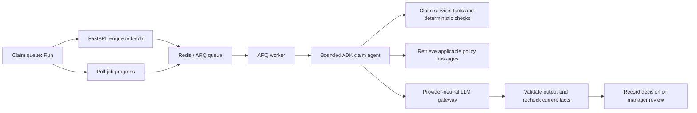

# Week 3 — Claims desk implementation and demo

This document summarizes the work completed in this session on the `week-3` branch: expense-claim UX, batch processing, a read-only chatbot, PostgreSQL policy RAG, local Vertex AI setup, evaluations and demo tooling.

## 1. Workspace and branch

The updated implementation is in:

```text
/Users/vishrut/.codex/worktrees/dfbe/enterprise-ai-claims
```

The original checkout at `/Users/vishrut/PDG/live-demo-inc-ent-dnep/enterprise-ai-claims` was on `main`. Both directories have the same folder name, so the terminal prompt alone does not identify the checkout.

```sh
cd /Users/vishrut/.codex/worktrees/dfbe/enterprise-ai-claims
pwd
git branch --show-current
```

The branch should print `week-3`. The original checkout's older UI and missing worker caused the repeated stale batch screens. Run the frontend, API and worker from the same updated worktree.

## 2. App and UX changes

- Changed the visible app labels to **Week 3** / **WEEK 3**. Removed “BATCH + RAG” and “reference” from those labels.
- Replaced the static queue button with **Run → Running → Finished**, including an animated running indicator.
- Added running/queued counts, a completion progress bar, individual job states and final claim outcomes.
- Automatically refresh claim and manager-review data as jobs progress.
- Preserve batch job IDs across refresh/navigation in browser-tab session storage.
- Discover active Redis jobs even when session storage is empty, including jobs submitted by the older UI.
- Show explicit worker/queue failures and a **Start another batch** control when submitted claims remain after a finished batch.
- Removed **Assess & process** from individual claim pages. Assessment is initiated through the claim queue.
- Added an always-visible chatbot near the top of every claim, with claim-specific context and suggested questions. Queue/review screens retain the floating assistant.
- Refresh submitted claim pages while batch results are pending.
- Added manager feedback distinguishing an investigation being opened from a completed manager decision.
- Collapsed verbose audit payloads under **Event details** so the main screen remains readable.

## 3. Seven expense claims

Seeding is additive and idempotent: it adds missing examples without overwriting existing claims or decisions.

| Claim | Expense | Amount | Expected reference-policy outcome |
|---|---|---:|---|
| CLM-001 | Client lunch | USD 84.50 | Accepted |
| CLM-002 | Personal entertainment | USD 125.00 | Rejected: category not allowed |
| CLM-003 | Airport taxi, receipt missing | USD 62.00 | Manager review |
| CLM-004 | Office stationery | USD 48.25 | Accepted |
| CLM-005 | Conference rail ticket | USD 186.00 | Accepted |
| CLM-006 | Hotel stay above allowance | USD 680.00 | Rejected: exceeds USD 500 limit |
| CLM-007 | Team lunch, receipt missing | USD 115.00 | Manager review |

These are expected results under the seeded policy and evidence. Automatic execution also depends on validated references, confidence and policy automation controls; uncertainty can route a claim to review.

## 4. Assessment and batch architecture



The agent follows a fixed retrieval trajectory through tools and application services. Deterministic checks run before model interpretation. The gateway validates structured output and constrains finding/evidence references to supplied IDs. The service rechecks claim version, policy and evidence before committing a controlled action.

Batch improvements include unique job IDs per batch, worker-heartbeat readiness checks, explicit failure reporting, two concurrent worker jobs, a five-second heartbeat interval and one-day result retention. Provider failures can retry through the existing ARQ policy. A running API alone does not start a worker.

| Endpoint | Purpose |
|---|---|
| `POST /api/jobs/assess` | Queue submitted claim IDs; returns HTTP 202 |
| `GET /api/jobs/active` | Discover current assessment jobs and worker availability |
| `GET /api/jobs/status?job_ids=...` | Read queued, running and terminal job results |
| `POST /api/chat` | Answer grounded questions without changing claims |

**202 Accepted means queued, not completed.** Completion is reported by job-status polling. A `404` from `/api/jobs/active` indicates that an older backend is being served.

## 5. Read-only chatbot

The assistant receives current claim facts, deterministic findings, evidence, assessment/outcome context and retrieved policy passages. Queue questions receive current queue summaries and applicable policies. Conversation history is bounded.

It returns structured answers with validated source IDs. It has no decision tools and cannot approve, reject or process a claim. Manager decisions remain explicit UI actions with rationale and version checks. Unknown citations and invalid responses fail safely.

Example demo question: open CLM-003 and ask **“What evidence is missing?”** The answer should explain the missing verified taxi receipt and cite supplied claim/policy context.

## 6. Policy README and PostgreSQL RAG

The readable source is [the expense policy README](policies/README.md). Its expanded 15-section version was preserved and reindexed.

Implemented:

1. Split policy Markdown into sections with stable passage IDs.
2. Generate document embeddings using Vertex `gemini-embedding-001` with 768 output dimensions. A deterministic mock adapter supports offline checks.
3. Store passage text, heading, source, content hash, policy ID, embedding-model identity and the vector in PostgreSQL using pgvector.
4. Embed each retrieval query and perform cosine-distance search, filtered to the applicable policy IDs and exact embedding-model identity.
5. Supply the top four passages to assessments and chatbot answers.
6. Record retrieved passages with the assessment-request audit event.

The migration creates `policy_chunks` and enables the `vector` extension. Local Compose uses `pgvector/pgvector:pg16`; the existing PostgreSQL volume was preserved. Starting the original checkout's plain PostgreSQL image can leave the vector library unavailable even though the database still lists the extension.

Ingestion replaces a policy's index only after all new embeddings succeed. `--if-needed` skips reindexing when content hashes and model identity match. No database transaction is held while awaiting query embeddings.

Retrieved text supports explanations. It does not override deterministic policy rules, replace reviewed-outcome memory or grant action authority to a model. Missing or mismatched indexes fail explicitly.

```sh
uv run --directory backend python -m app.rag.index
# Only refresh when the source/model changes:
uv run --directory backend python -m app.rag.index --if-needed
```

## 7. Local Vertex setup and fixes

- Fixed `.env` discovery so backend launches load the repository-root configuration.
- Used application-default credentials for local Vertex AI.
- Tightened model output schemas so findings use exact deterministic check codes and evidence references use actual supplied IDs.
- Kept provider SDK calls inside adapters and retained mock, Ollama, Vertex and BTP provider boundaries.

Relevant root `.env` settings:

```dotenv
LLM_PROVIDER=vertex
LLM_MODEL=gemini-2.5-flash
GCP_PROJECT_ID=your-project-id
GCP_LOCATION=asia-south1
RAG_ENABLED=true
EMBEDDING_PROVIDER=vertex
EMBEDDING_MODEL=gemini-embedding-001
EMBEDDING_LOCATION=us-central1
ARQ_QUEUE_NAME=claims
```

Generation and embeddings can use different supported regions. Authenticate with `gcloud auth application-default login`. Index the policy before enabling RAG. Credentials and local `.env` contents are not included in this document.

## 8. Run manually

Install dependencies if needed:

```sh
cd /Users/vishrut/.codex/worktrees/dfbe/enterprise-ai-claims
(cd backend && uv sync --extra gcp)
(cd frontend && pnpm install)
docker compose -p enterprise-ai-claims up -d --wait postgres redis
uv run --directory backend alembic upgrade head
uv run --directory backend python -m app.seed
uv run --directory backend python -m app.rag.index --if-needed
```

Use three terminals. These commands explicitly select the updated worktree.

**Backend:**

```sh
uv run --directory /Users/vishrut/.codex/worktrees/dfbe/enterprise-ai-claims/backend uvicorn app.main:app --host 127.0.0.1 --port 8000
```

**Batch worker:**

```sh
uv run --directory /Users/vishrut/.codex/worktrees/dfbe/enterprise-ai-claims/backend arq app.jobs.worker.WorkerSettings
```

**Frontend:**

```sh
pnpm --dir /Users/vishrut/.codex/worktrees/dfbe/enterprise-ai-claims/frontend dev --host 127.0.0.1 --port 5173 --strictPort
```

Open **http://127.0.0.1:5173**. Press Ctrl+C in each terminal to stop its process. Stop older servers occupying these ports before starting replacements.

Check backend/worker readiness:

```sh
curl http://127.0.0.1:8000/api/jobs/active
```

It should return `jobs` and `worker_available`. Wait for the worker heartbeat before starting a batch.

## 9. Optional demo launcher

```sh
bash /Users/vishrut/.codex/worktrees/dfbe/enterprise-ai-claims/scripts/demo.sh
```

The launcher selects the correct checkout, starts PostgreSQL/Redis using the existing Compose project, applies migrations, seeds missing claims, refreshes the policy index if needed and starts frontend/API/worker together. Ctrl+C stops all three application processes; database services remain running. Manual launching remains fully supported.

## 10. Evaluations

Added a report-producing suite with **20 evaluation cases**, including the original six regression scenarios as one grouped case.

| Group | Cases | Coverage |
|---|---:|---|
| RAG | 5 | Indexing, receipt/currency/date retrieval at rank 1, source traceability and policy isolation |
| Batch workflow outcomes | 7 | Seeded claim statuses, valid finding/evidence references, bounded trajectory, RAG use and review creation |
| Chat | 3 | Missing receipt explanation, refusal to execute approval, unchanged state and invalid-citation rejection |
| Manager review | 1 | Review closure, final acceptance and reviewed outcome memory |
| Guardrails | 3 | Unknown findings, unknown evidence and low-confidence acceptance |
| Regression | 1 | Existing acceptance/rejection/investigation, unsafe acceptance, invalid output and stale version scenarios |

Run from the worktree root:

```sh
uv run --directory backend python -m app.evaluation.suite
```

Reports are written to `backend/evaluation-results/latest.json`, an ignored generated directory. Reports contain per-case checks, failures, timings, group totals and pass rate. Exit status is 0 only when every case passes. Tests verify that a deliberately wrong expectation is reported and remaining cases continue.

The default suite uses isolated in-memory storage and deterministic mock generation/embeddings. It validates application behavior, not live model quality, and does not modify demo claims or use PostgreSQL/Redis.

Optional live model evaluation:

```sh
uv run --directory backend python -m app.evaluation.suite \
  --provider vertex --output evaluation-results/vertex.json
```

This sends synthetic evaluation contexts and policy text to the configured Vertex services, with normal API usage. Retrieval and chat grading use transparent heading/keyword checks, validated source IDs and business-state invariants; they are not a comprehensive semantic benchmark.

The browser scenario evaluates the actual HTTP/ARQ/UI flow:

```sh
pnpm --dir frontend exec playwright test
# Optional live Vertex generation and RAG:
DEMO_TEST_VERTEX=1 pnpm --dir frontend exec playwright test
```

See [EVALS.md](EVALS.md) for full coverage, limitations and report instructions.

## 11. Verification completed

- Offline eval suite: **20/20 passed**.
- Backend regression run after adding eval tests: **52 passed, 4 PostgreSQL integration tests skipped** when integration environment variables were absent.
- Earlier full backend integration run: **54 passed**, including PostgreSQL/Redis checks, before the two new eval-runner tests were added.
- Frontend tests: **11 passed** during demo refinement.
- Frontend lint and production build passed after the final label changes; backend lint passed after adding evals.
- Browser tests verified Run → Running → Finished, seven claim outcomes, refresh persistence, inline chatbot and manager review.
- The browser scenario also passed with **live Vertex generation and policy RAG: seven assessments completed, zero failed jobs**. That test used an isolated database/queue.
- Live policy embeddings and PostgreSQL cosine retrieval were verified; the expanded policy was subsequently reindexed by the launcher.
- The launcher startup/shutdown was smoke-tested with an isolated worker queue.
- Claims, assessments, reviews, decisions, outcomes, audit events and executions were compared with a pre-upgrade backup during the RAG work and were unchanged.
- Verification servers/workers were stopped after demo testing. Later manual server launches belong to the user's active viewing session.

The new standalone `--provider vertex` eval suite is available but was not run in this session; the live Vertex result above refers to the browser scenario.

## 12. Reset command supplied

A transactional reset command was supplied to return all claims to `submitted`, increment their versions and clear review decisions/tasks, outcomes, assessments, findings and AI execution records. It retains claims, receipts, policy rules, RAG embeddings and audit history.

With backend and worker stopped, the supplied command is:

```sh
docker exec -i enterprise-ai-claims-postgres-1 psql -U claims -d claims -v ON_ERROR_STOP=1 <<'SQL'
BEGIN;
DELETE FROM review_decisions;
DELETE FROM review_tasks;
DELETE FROM outcome_records;
DELETE FROM claim_assessments;
DELETE FROM policy_findings;
DELETE FROM ai_executions;
UPDATE claims SET status = 'submitted', version = version + 1;
COMMIT;
SQL
```

This deletes assessment/review results. After resetting, refresh the UI and use **Start another batch** if it still displays a finished batch from browser storage. Queued Redis jobs are not cleared by this SQL command and can resume when the worker restarts.

## 13. Where to read the code

| Area | Main files |
|---|---|
| App navigation and labels | `frontend/src/App.tsx` |
| Batch controls and polling | `frontend/src/features/claims/ClaimQueue.tsx` |
| Claim facts and inline assistant | `frontend/src/features/claims/ClaimDetail.tsx`, `frontend/src/components/ClaimsAssistant.tsx` |
| Manager decisions | `frontend/src/features/reviews/Reviews.tsx` |
| HTTP contracts | `frontend/src/api/client.ts`, `backend/app/api/routes.py` |
| Queue/worker lifecycle | `backend/app/jobs/worker.py` |
| Bounded assessment workflow | `backend/app/workflows/process_claim.py`, `backend/app/agents/claim_agent.py`, `backend/app/tools/claims.py` |
| Business controls and persistence | `backend/app/assessment/service.py`, `backend/app/db/repositories/claims.py` |
| Model gateway and providers | `backend/app/ai/gateway.py`, `backend/app/ai/providers/` |
| Read-only assistant | `backend/app/assistant/service.py` |
| Policy embeddings and retrieval | `backend/app/rag/`, `backend/app/db/models/__init__.py` |
| Policy source | `docs/policies/README.md` |
| Eval runner and ground truth | `backend/app/evaluation/suite.py`, `backend/app/evaluation/datasets/demo.json` |
| Browser demo checks | `frontend/e2e/claims.spec.ts` |
| Managed local startup | `scripts/demo.sh` |

For a more focused walkthrough, read [CODEBASE_GUIDE.md](CODEBASE_GUIDE.md).
